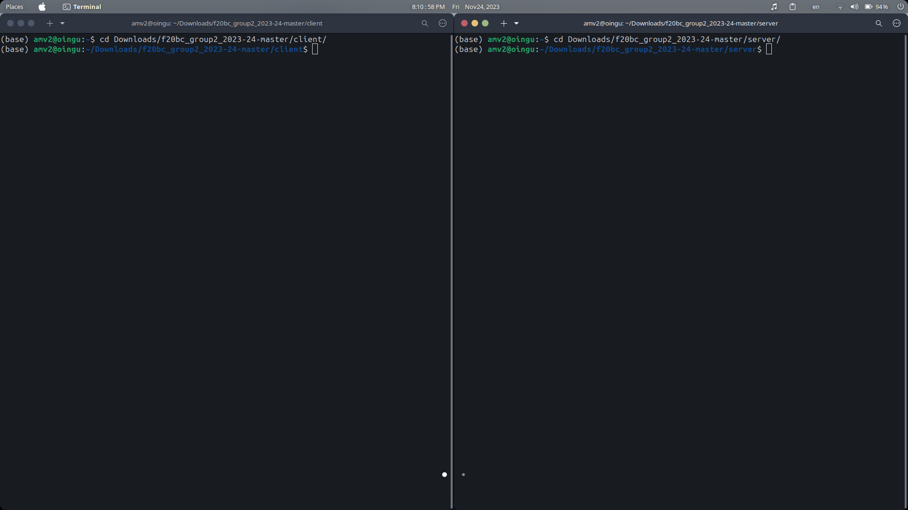
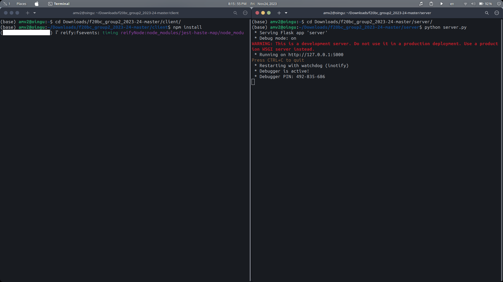
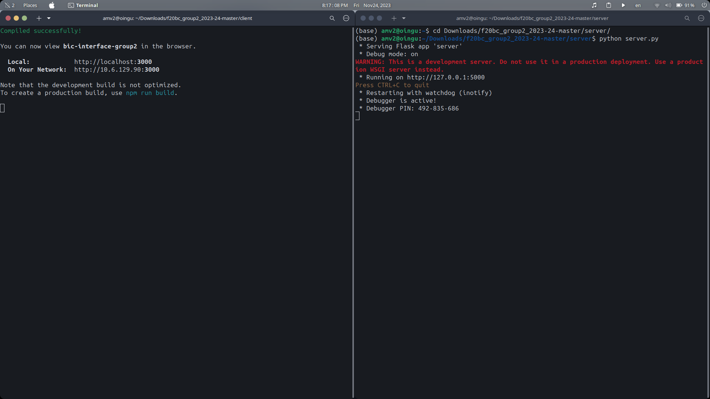

# Install dependencies

Ensure you have numpy and pandas installed

```bash
pip install numpy

pip install pandas
```

Ensure you have node installed

https://docs.npmjs.com/downloading-and-installing-node-js-and-npm

Ensure you have Flask installed

pip install Flask

# Create the Flask server

```bash
cd server/

python -m venv venv

or

python3 -m venv venv
```

# Install the dependencies in the client directory

```bash
cd client/

npm install
```

# How to Run



### Step 1

Open 2 terminals and cd into this project's client and server directory

### Step 2: Start the Backend (Server-side)

In the terminal with the server directory open,

type: "python server.py" or "python3 server.py" depending on your operating system

```bash
cd server/

python server.py

python3 server.py
```



### Step 3: Load up the Frontend (Client-side)

In the terminal with the client directory open,

type: "npm start" (or "yarn start" if you have yarn installed)

The frontend will connect to the proxy specified in the package.json file (ie. it will connect to the server).

```bash
cd client/

npm start

or

yarn start

```



Test out some hyperparameters in the interface!


# Code References:

### Code references are included in the files specific to them as well as below

Sources and references used for activation function formulas:

https://medium.com/analytics-vidhya/activation-functions-all-you-need-to-know-355a850d025e#:~:text=Formula%20%3A%20f(z)%20%3D,the%20probability%20as%20an%20output.

https://www.mygreatlearning.com/blog/activation-functions/

https://www.analyticsvidhya.com/blog/2021/04/activation-functions-and-their-derivatives-a-quick-complete-guide/

https://www.v7labs.com/blog/neural-networks-activation-functions

Sources used for loss functions theory and formulas

https://www.datarobot.com/blog/introduction-to-loss-functions/#:~:text=Further%20reading-,What's%20a%20loss%20function%3F,ll%20output%20a%20lower%20number.

https://towardsdatascience.com/what-is-loss-function-1e2605aeb904

https://builtin.com/machine-learning/common-loss-functions

https://www.analyticsvidhya.com/blog/2019/08/detailed-guide-7-loss-functions-machine-learning-python-code/

https://www.geeksforgeeks.org/ml-common-loss-functions/

Sources used for ANN

https://www.youtube.com/watch?v=TkwXa7Cvfr8&t=364s

Sources used for PSO

https://cs.gmu.edu/~sean/book/metaheuristics/Essentials.pdf

Sources used for frontend and backend

https://www.youtube.com/watch?v=7LNl2JlZKHA

https://github.com/briancodex/react-website-v1/
